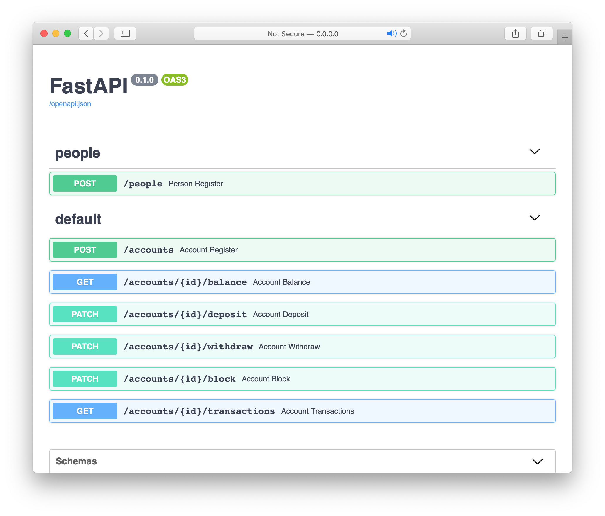

# Banking DDD Expriment

Este repositório contém uma aplicação escrita em `Python >= 3.7` que está dividida em várias camadas. A implementação tenta seguir algumas ideias do `DDD` e da `arquitetura hexagonal`.

## Dependênias

- Python `3.7`
- PostgreSQL `13.1`

## Instalação

É recomandável instalar e utilizar a aplicação a partir da imagem _Docker_, tudo deve funcionar com a execução deste comando:

```shell
$ docker-compose up
```

Você também pode optar pela instalação local sem ajuda do _Docker_, neste caso garanta que as dependências sejam atendidas. Também é recomandado que a instalação seja feita utilizando um ambiente virtual do `Python`. Para iniciar a instalação, rode os comandos:

```shell
$ python -m venv .venv && source .venv/bin/activate
$ pip install -r requirements.txt
$ python setup.py install
```

Agora edite o arquivo `.env` e informe a _URL_ em formato de `DSN` para o seu banco de dados. Neste ponto a aplicação já deve estar instalada no seu _path_ virtual e pronta para ser executada.

Para rodar a aplicação, execute:

```shell
$ uvicorn banking.api:app --host 0.0.0.0 --reload
```

A API estará disponível no endereço http://0.0.0.0:8000/.

### Desenvolvimento e testes

O desenvolvimento desse experimento levou em consideração a prática da execução de testes de mutação, para verificar a sua saída execute:

```shell
$ mut.py --target banking --unit-test tests -c --timeout-factor 0.5
```

Se quiser apenas executar os testes de integração e unidade, execute:

```shell
$ python setup.py test
```

### API e Documentação

Para este projeto o micro _framework_ `FastAPI` foi escolhido. A cultura de definição de tipos e da convenção em detrimento da configuração torna o desenvolvimento mais ágil e prazeroso.

Outra facilidade que o `FastAPI` nos traz é a geração automática de documentações do tipo `swagger`, com a aplicação rodando basta acessar o endereço:

- http://0.0.0.0:8000/docs

Você deve ver algo semelhante a imagem abaixo:

